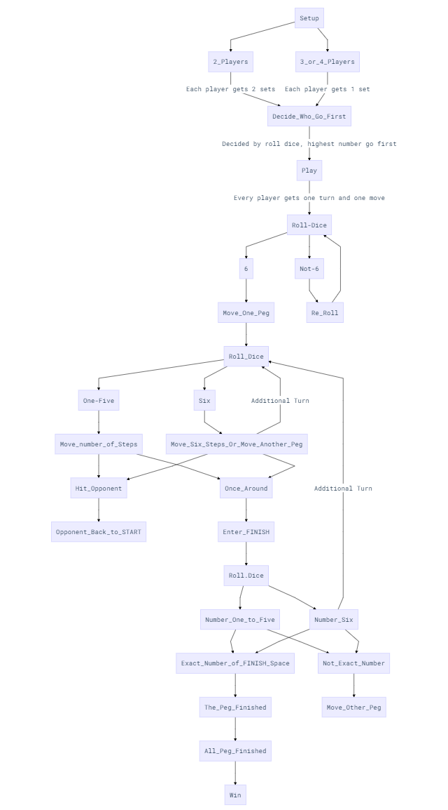

# Trouble with HTML, CSS, JavaScript

## Planning graph

## Checklist

### Setup

- [x] Number of players
- [x] Name of players
- [x] Two players, each player gets two pegs
- [x] Three to four players, each player gets one peg
- [x] Gameboard

### Game

- [x] Rolling dice
- [x] Moving pegs
- [x] Can't have two pegs on same position
- [x] Hitting Opponents
- [x] Finish Line
- [x] Check Winner
